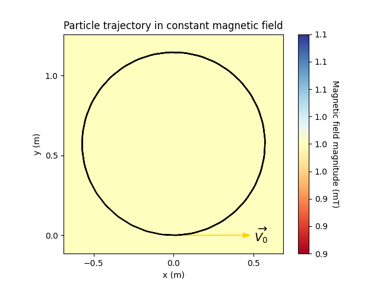
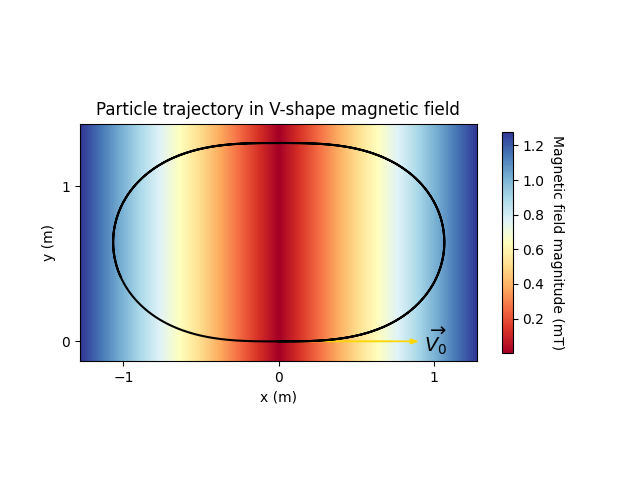
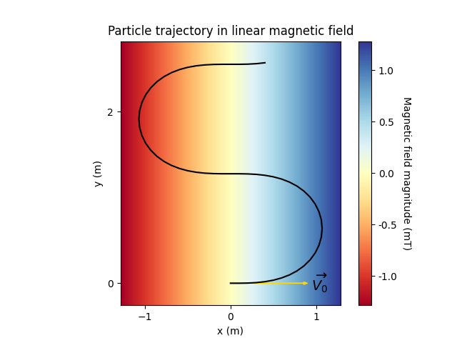
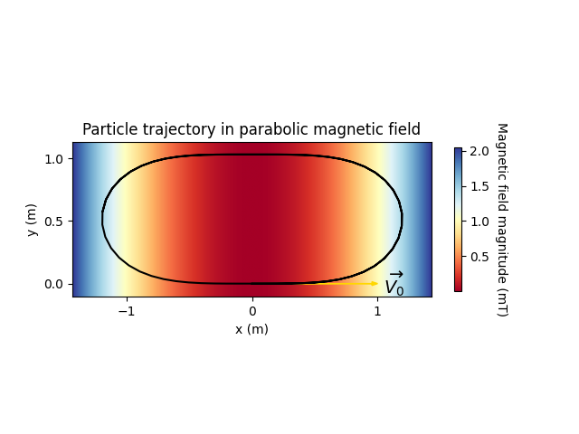
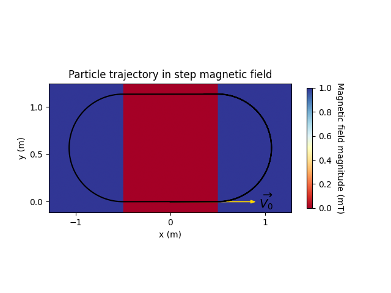
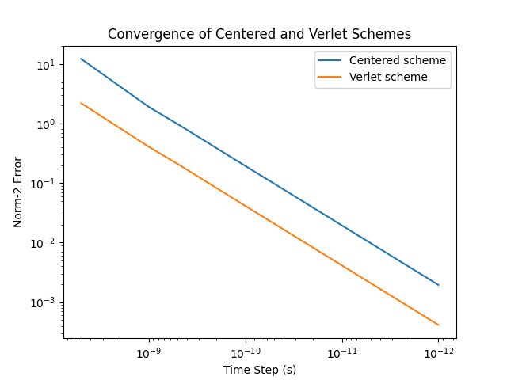

# LorentzTrajectory

This code is a simple simulator for a particle moving in a magnetic field. It can solve the mechanical PDE using central finite difference or Verlet's method. A benchmark of the two methods can be generated with benchmark.py

## Usage

You will need numpy and matplotlib to run the code, it is all Python. To generate the particle trajectories, use:

    python3 plot.py

To generate the the convergence plot for the two integration schemes, use:

    python3 benchmark.py

## Results

Below are the plots of the particle's trajectory for different forms of magnetic field. Only the field's magnitude is variable, its orientation is always orthogonal to the plot's plane, and directed towards us.

## Methods

Two numerical methods are implemented here: a two-step central finite difference scheme and Verlet's method. Both are consistent and stable (I think Verlet's method is unconditionnally stable in our case). They are order one methods, see below their convergence graphs:

